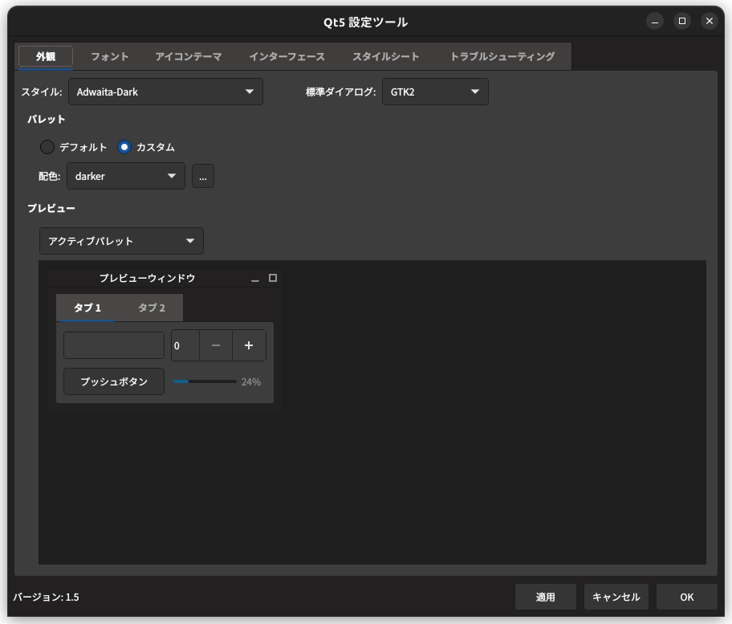

# 再起動しても複数タブを復元可能なファイルマネージャー`pcmanfm-qt`

## はじめに
PCを再起動させたとき、電源を落としたときと同じ環境を再現したいものです。
ずっと昔のGNOME環境ではそのような仕組みがありましたが、`wayland`に移行する影響からそれらの仕組みは廃止されました。
しかし、毎度複数のタブをファイルマネージャで開き直すのは手間です。
システム再起動後に複数開いているファイルマネージャーのタブをそのまま開きたい。
調べたところ、`pcmanfm-qt`がそれを実現可能であることがわかりました。


#### 設定ファイルについて

`pcmanfm-qt`のタブ復元機能について、設定ファイルが破損することがあります。この場合、設定ファイルを修復するか、新しい設定ファイルを作成して正しい形式で保存する必要があります。

そのため、事前に`~/.config/pcmanfm-qt/default/settings.conf`をバックアップしておいたほうが良いと思います。

またこのファイルについては少しクセがあり、以下の点を留意しなくてはいけません。
```bash
$ file -i ~/.config/pcmanfm-qt/default/settings.conf
/home/***/.config/pcmanfm-qt/default/settings.conf: application/x-setupscript; charset=us-ascii
```
`settings.conf`は日本語を扱えないということです。
UTF-8文字列はエスケープシーケンスとして表記されなければなりません。もしUTF-8のまま設定ファイルを保存するとエラーダイアログが出ます。
- `\x30d3\x30c7\x30aa`は`ビデオ`に対応します。
- `\x30c0\x30a6\x30f3\x30ed\x30fc\x30c9`は`ダウンロード`に対応します。


```bash
[Window]
AlwaysShowTabs=true
FixedHeight=480
FixedWidth=640
LastWindowHeight=1085
LastWindowMaximized=false
LastWindowWidth=1722
PathBarButtons=true
RememberWindowSize=true
ReopenLastTabs=true    <- trueであること。
ShowMenuBar=true
ShowTabClose=true
SidePaneMode=places
SidePaneVisible=true
SplitView=true
SplitterPos=150
SwitchToNewTab=true
TabPaths=/home/***/\x30d3\x30c7\x30aa, /home/***/\x30c0\x30a6\x30f3\x30ed\x30fc\x30c9
```
（実際にはもっと大量のタブを開いていますが、ここではexampleとして表記しています。）
タブの復元については以下の部分が該当します。
- ReopenLastTabs
- TabPaths

***`pcmanfm-qt`が起動している時にこの設定ファイルを書き直しても`pcmanfm-qt`が再起動する際に上書きされます。ですので、`pcmanfm-qt`を終了させてから設定ファイルを上書きしてください。***


#### インストールに必要なパッケージ（Qt5ct）

GNOME環境でQtアプリケーションを使用する場合には、`qt5ct`（Qt5 Configuration Utility）もインストールして設定を行うとよいです。これにより、スタイルがGNOME環境に馴染み、使いやすくなります。



> (Packageから引用)
> **Qt5 Configuration Utility**
> このユーティリティは、Qt統合がないデスクトップ環境やウィンドウマネージャーでQt5の設定（テーマ、フォント、アイコンなど）を構成することができます。
>
> Qt5ctはPlasma以外の環境でのみ有効です。
> デフォルトの構成には、Plasma上での実行を無効にするスイッチがあります。
>
> Qt5ctは、qt5 gtkテーマ、KDE breezeテーマ、fusionテーマ、QtCurveテーマなど、さまざまなスタイルを使用できます。各スタイルは、カラースキーマを変更することでさらにカスタマイズできます。

`kdenlive`、`vlc`、`KDE Connect`など、KDEアプリケーションを使用する場合にも恩恵があります。

以上です。ありがとうございました。

## 備考
`pcmanfm-qt`は、有名な`PCManさん（洪任諭（Hong Jen Yee）@台湾）`が開発したファイルマネージャーです。確か元？お医者さんだった気がします。すごい方です。

## 参考文献
- [PCMan File Manager](https://en.wikipedia.org/wiki/PCMan_File_Manager)
- [PCManFM - ArchWiki](https://wiki.archlinux.jp/index.php/PCManFM)
  - [サムネイル関連](https://wiki.archlinux.jp/index.php/PCManFM#.E3.83.92.E3.83.B3.E3.83.88.E3.81.A8.E3.83.86.E3.82.AF.E3.83.8B.E3.83.83.E3.82.AF)
